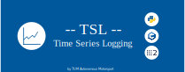
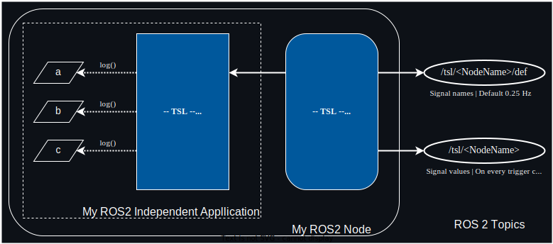

TSL is a package that is designed for cyclically logging time values representing a huge amount of different time series.
High efficiency and low computational overhead was a main priority during the development. Because of this, a **huge number of signals** can be logged with a very **low overhead**. 

A special use case can be internal debug signals of algorithms. These usually change frequently during the development of the algorithm.
Therefore using a standard ROS 2 msg definition can be a challenging, since modifying the message definition breaks compatiblity with older previously recorded rosbags.

You should also check out the other 2 excellent libaries ([Data Tamer](https://github.com/PickNikRobotics/data_tamer) | [pal_statistics](https://github.com/pal-robotics/pal_statistics)) libraries that try to tackle exactly this problem. However, none of those exactly suited our requirements (see features below).

## Features
- **Python | Cpp**: While being written in CPP, TSL is the only library that support both logging from Python and CPP. Therefore it allows for consistent logging in a mixed language ROS 2 Stack.
- **Cyclic Publish of Definition**: While other libraries use the transient_local qos setting to publish their definition message, we publish them continously. This is mainly because there are a few problems with transient_local:
    - No IPC Support
    - After a BagSplit in a ROS 2 bag recorder, the newly created mcap files do not contain the msg definitions any more required to parse the logged signals.
- Logs any numeric data type
- Possibility for registering **custom types**: See this [Example](./tsl_logger_cpp/examples/log_custom_types.cpp).
- **No custom serialization format**: Therefore no dependency to open and deserialize the ROS 2 bags 
- Preserialization of Definition Message: Saves CPU Resources since the definition is preserialized and cached before it is sent out.
- Allows modules to stay **ROS 2 independent**: Because of a clear separation of logger and publisher, using the logger does not introduce a ROS 2 dependency in your code.
- **Signal Compression**: Use custom compression strategies in order to reduce bandwidth and storage requirements for your logged signals. See this [Example](./tsl_ros2_publisher_cpp/examples/compression.cpp).
- **PlotJuggler** Support: PlotJuggler automatically parses all logged time series signals. At the moment, this requires a custom version of PlotJuggler ([get it here](https://github.com/simonsag96/PlotJuggler/tree/add_support_tsl_messages)). However, a merge request to integrate this in the official version of PlotJuggler is pending.
- **Different Logging Strategies**: You can either log values explicitly by value or by just storing their memory address. Consider these examples: [Reference Logger](./tsl_logger_cpp/examples/reference_logger.cpp) | [Value Logger](./tsl_logger_cpp/examples/value_logger.cpp)


## Limitations
 - Currently, you can't log additional logging signals after the first publish of the ROS 2 publisher. This is a limitation of the current implementation and will be changed in a future release. 
 - Regularly publishing the signal definition creates more traffic. However, since we publish with a low frequency and use preserialized definition messages this is not a big problem.


## Architecture



The logger is completely independent from the publisher and allows to keep your function code independent from ROS 2. It is that independent, that one could write the logged signals into a csv instead of publishing them in ROS 2.
However, since writing to disk is a bad idea in real-time applications, we haven't bothered implementing a csv-writer on top of the ROS 2 publisher.

The ROS 2 publisher just takes the reference to the logger in order retrieve the logged values. These are then published to the topic `/tsl/<fully_qualified_node_name>` along with a definition (the signal names in the same order as they are represented in the values msg) to `/tsl/<fully_qualified_node_name>/def`. In order to save bandwidth, by default the definition is only published once every 4 seconds.


## Minimum Working Example

For a minimum example of using the logger in a ROS 2 environment, consider [this example](./tsl_ros2_publisher_cpp/examples/node_integration.cpp)

## Performance Benchmarks

These performance numbers were generated using an 11th Gen Intel(R) Core(TM) i7-11850H Mobile CPU.
You can generate this benchmark report yourself using [this executable](./tsl_ros2_publisher_cpp/examples/benchmark.cpp).

```
Logging signals:
=======================================
Logging 1000 signals 10000 times took 696161852 ns
Average time per signal: 69 ns

Creating messages:
=======================================
Creating a message for the first time took on average: 220044 ns | Average time per signal: 220 ns
Creating a message for the subsequent times took on average: 34737 ns | Average time per signal: 34 ns

Message sizes:
=======================================
Definition message size: 28024 bytes
Values message size: 4064 bytes
```

## Package Overview

| Package Name | Usage Examples | Description  |
| ------------ | ----------- | --------------- |
| [`tsl_logger_cpp`](./tsl_logger_cpp/) | [`Examples`](./tsl_logger_cpp/examples) | Contains the different tsl loggers. | 
| [`tsl_logger_py`](./tsl_logger_py/) | [`Examples`](./tsl_logger_py/examples) | Python Binding | 
| [`tsl_msgs`](./tsl_msgs/) | - | Message set for the tsl_ros2_publisher | 
| [`tsl_ros2_publisher_cpp`](./tsl_ros2_publisher_cpp/) | [`Examples`](./tsl_ros2_publisher_cpp/examples) | Implementation of the ROS 2 publisher | 
| [`tsl_ros2_publisher_py`](./tsl_ros2_publisher_py/) | [`Examples`](./tsl_ros2_publisher_py/examples) | Python Binding | 


Furthermore, there are additional packages can be found under `./experimental`. 
These experimental packages are not as well documented and tested as the other packages in this repository.
Therefore, using these packages at your own discretion.

## Compilation

Everything should just compile using colcon. The packages `tsl_logger_cpp` and `tsl_logger_py` should compile without ROS 2 installed. 
For the other packages, having a installation of ROS 2 is required.

**Disclaimer**: This package was developed using Ubuntu 22.04 and ROS 2 Humble. 
It is expected to work also for future Ubuntu and ROS 2 releases. 
However, if you experience problems with compilation, please open an Issue.  


## Core Developers
 - [Simon Sagmeister](https://github.com/simonsag96)

## Acknowledgments

Special thanks to my colleagues for the regular technical feedback and talks during the development phase of this package.:
- [Simon Hoffmann](https://github.com/simonh92)


We gratefully acknowledge financial support by:
 - Deutsche Forschungsgemeinschaft (DFG, German Research Foundation) | Project Number - 469341384
